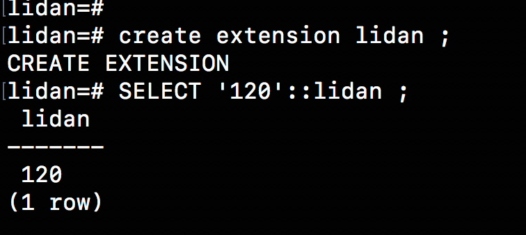

# 李源

# Create an extension for PostgreSQL

# 目录

为什么要为数据库创建扩展？

什么是数据库原生类型？

数据库原生类型的好处？

创建一个插件\(为postgresql添加新的原生类型）？

# 为什么要为数据库创建扩展？

一般而言，我们为数据库创建扩展是为了支持一些数据库本不支持的数据类型或索引类型， 实现数据的统一管理和高效处理。

如空间数据和属性数据的统一管理（postgis）

如超大图像数据和属性数据的统一管理（PostPic）

以及其他为了高效处理的索引插件，这里不做讨论。

# 什么是数据库原生类型？

数据库为 某一个特定类型的处理，表示，存储，转换提供特定的底层支持 ，而不是在数据库原有数据基础上开发新类型或组合。（我的理解）

# 数据库原生类型的好处？

1\.尽管有复杂的数据库机制可以保证用户自定义数据库类型和特定函数，但是这些用户自定义类型有很多局限，比如  __无法自定义类型对应的复杂函数，如哈希函数，无法自定义索引，数据类型只能是现有类型的组合（也即子集）__    __…__ 

2\.为了实现 _类型的自定义，多种类型的入库和数据统一管理，以及部分数据的快速处理和算法定制（数据库索引定制），故而很多人开发插件引入第三方的数据库原生类型。_

# 数据库原生类型好处（个人体会）

CREATE  OR  REPLACE  FUNCTION  loopinsert  70  \(

n  INTEGER  DEFAULT  70

\)

RETURNS  VOID  AS  $$

DECLARE

rec RECORD;

counter  INTEGER  :=  0  ;

BEGIN

FOR rec  IN  select  \*  from  beijingPOI

LOOP

insert  into  ss30

select  rec\.id  as  id \,  rec\.type  as  type  \,  string\_agg  \(  shit\.type  \,  ';'  \)  as  contexttype\,array\_to\_string  \(  array\_agg  \(  shit\.dis  \)\,  '\,'  \,  '\*'  \)  as  dis  from

\(  select  a\.type  as  type  \, \(  a\.geodata  \<\->

\(  select  geodata  from  wuhuanpoi  where  id =  rec\.id  \)\)  as  dis

from  wuhuanpoi  as  a

where  a\.id  \!=  rec\.id

order by  dis

limit  n\)  as  shit ;

counter  :=  counter  \+  1  ;

if  MOD\(  counter  \,  10000  \) =  0  then

RAISE NOTICE  '%'  \,  counter  ;

end  if  ;

END  LOOP  ;

END  ;

$$  LANGUAGE  plpgsql  ;

如何对1000万点数据进行综合距离和属性的KNN查询并排序，并导出，在1分钟以内（在i77代cpu，m2ssd上）。

这本需要非常复杂的索引机制和要求非常鲁棒高效的代码，但是在postgis的基础上， _写了一个数据库过程和一些_  _function_  _，_ 运行30秒，我就拿到了答案\(K=70\)。

# 如何创建数据库原生插件？

依靠官方文档？

依靠github？

依靠自我探索？

依靠geekblog？

# 一些重要的机制和点

# 插件机制

1\.数据库内部存在大量的system catalogs，并将数据的表，列等存储在这些文件中。 但  postgresql  不仅在文件中存储了表，列等，而且还存储了数据类型，以及数据类型对应的方法。 这意味着postgresql可以通过增加文件的方式，增加systemcatalogs， 进而增加原生类型，以及这些类型对应的方法，索引等等 。而这些机制，并不是在所有的数据库中都存在，所以postgresql的扩展性非常好，非常适合定制，如鼎鼎大名的postgis。

2\.相似的mysql也有类似的机制

# 具体的插件实现

postgresql提供了一些固定的接口来让您替换掉很多重要过程，如创建类型中的in，out等函数，这些函数通过特定的宏注册，然后编译为动态链接库（dylib\,dll\,so\)等，然后你就在sql中定义这些你注册的函数，然后就可以正常使用了。

PG\_FUNCTION\_INFO\_V1\( lidan\_in \); //  注册  函数

Datum//返回类型，也即数据库中的保存对象 lidan\_in \(PG\_FUNCTION\_ARGS\)（ 一个类似变长数组的  flag ）

\{

char \*str = PG\_GETARG\_CSTRING\(0\); //  获得变长列表中的参数

…//自定义的处理过程。

\}

CREATE TYPE lidan\( INPUT = lidan\_in  \,  OUTPUT = lidan\_out  \,  LIKE = integer \) ;

\-\-  在  sql  文件中调用  C  函数 lidan\_in 函数和  lidan\_out  函数

CREATE FUNCTION lidan\_in\(cstring\)RETURNSlidanIMMUTABLESTRICTLANGUAGE CAS '$  libdir  /  lidan  '\, '  lidan\_in  ';

# 过程总结

* 我们扩展的过程可以概括为：
  * 1\.注册你自定义的函数，
  * 2\.然后将注册函数在sql中写一个代理函数
  * 3\.将这些你自定义的函数编译成dll（通过特定格式的makefile）
  * 4\.将dll和你定义的sql放入postgresql文件夹（makeinstall时自动完成）

PG\_FUNCTION\_INFO\_V1\( lidan\_in \); //注册函数

Datum//返回类型，也即数据库中的保存对象l idan\_in \(PG\_FUNCTION\_ARGS\)（ 一个类似变长数组的  flag ）

\{

char \*str = PG\_GETARG\_CSTRING\(0\);//获得变长列表中的参数

…//自定义的处理过程。

\}

CREATE TYPE lidan \( INPUT = lidan\_in  \,  OUTPUT = lidan\_out  \,  LIKE = integer \) ;

\-\-  在  sql  文件中调用  C  函数 lidan\_in 函数和  lidan\_out  函数

# 项目总结

# 一个标准插件的项目目录？

* 1\.src
  * XX\.hXX\.c定义并注册的函数，定义类型，定义你想覆盖的数据库操作的函数等。
* 2\.test
  * 测试sql，此类型你是否创建成功。
* 3\.filesnamedXX\.sql（createextensionXX）
  * 通过sql重建新类型，并覆盖类型操作（使用注册的函数）
* 4\.extension\_name\.control
  * 版本，名字等插件元信息。
* 5\.特定格式的makefile。

# 即将实现的uint插件

目前的postgresql插件并不支持uint类型

目前的uint的插件的hash函数非常差

我个人准备实现一个uint数据类型，并使用murmurhash算法作为hash算法。

Murmurhash算法已经广泛的用于各种开源数据库，如redis的数据类型的hash算法就是murmurhash，被认为是目前最好的hash算法之一。

# 我自己的uint插件

[https://github\.com/lidan233/PostLidan](https://github.com/lidan233/PostLidan)

目前还是一个toy插件

即将重构为postgresql的支持uint的插件

# 鸣谢

1\.感谢我的帅气单身的朋友王银沼同学对我的帮助

2\.感谢一些经典且简单的github库在这个过程中对我的帮助，比如：使用python文件生成很多相似的重复sql

3\.通过抄袭，偷袭，不给star等方法，我学习到了知识，这好吗？这不好，希望朋友们参考我写的垃圾代码时候，能够不吝star（虽然我也不会维护）

